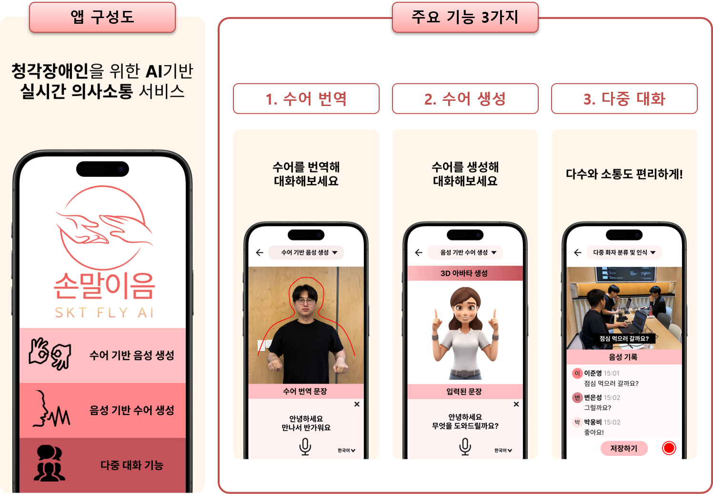

# 손말이음 - 청각장애인을 위한 AI 기반 실시간 의사소통 서비스

## Overview
손말이음(Sonmalyieum) is an AI-based real-time communication service developed to assist hearing-impaired and non-impaired individuals in communicating effectively. The project was created during the "SKT FLY AI Academy" and features three core functionalities: 수어번역(Sign2Speech), 수어생성(Speech2Sign), and 다중대화(Multi-party Communication). This repository contains the code for the Sign2Speech feature, which translates Korean Sign Language (KSL) into text and speech in real-time.

## Sign2Speech Feature

This functionality enables users to:

- Convert KSL gestures into both written and spoken language.
- Assist non-impaired users in understanding sign language during conversations.
- Provide real-time translation using an AI-based sign recognition model that analyzes video input.

## Dataset and Methodology
The Sign2Speech functionality was developed using the KSL-GUIDE dataset, a large-scale Korean Sign Language dataset designed for guiding the deaf and hard-of-hearing. The key reference for this dataset is:

- Ham, Soomin, et al. "Ksl-guide: A large-scale Korean sign language dataset including interrogative sentences for guiding the deaf and hard-of-hearing." 2021 16th IEEE International Conference on Automatic Face and Gesture Recognition (FG 2021). IEEE, 2021.

## Key Features
- Sign2Speech: Real-time sign language translation to text and speech.
- Speech2Sign: (Not included in this repository) Converts spoken language into sign language using a 3D avatar.
- Multi-party Communication: (Not included in this repository) Facilitates group communication with real-time speech and sign language translation.

## Future Work
We plan to expand this feature by:

- Increasing the range of KSL gestures supported.
- Improving translation accuracy for real-world use cases.
- Optimizing the model for faster real-time processing.

## Contributing
Feel free to contribute to this project by submitting pull requests or reporting issues.
